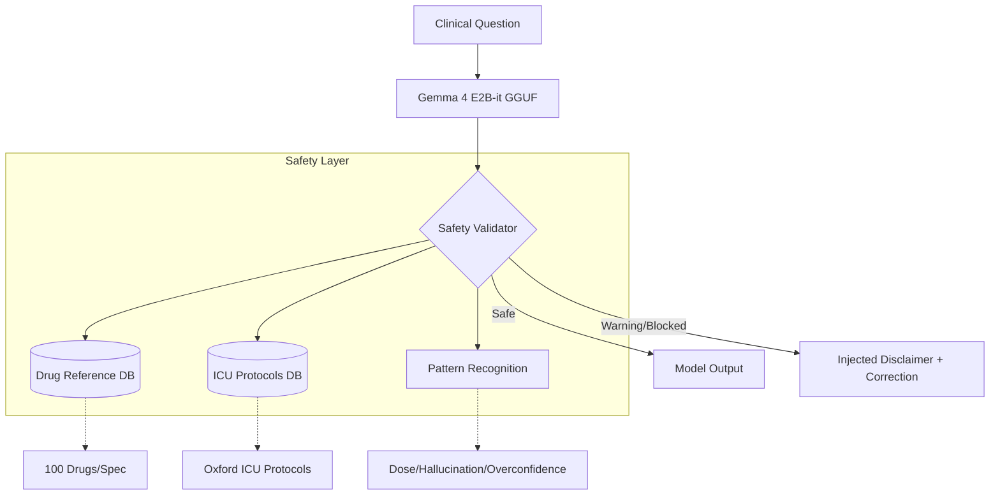

# 🏥 IatrogeniX: Clinical AI Safety Layer
**Official Submission for the Kaggle "Gemma 4 Good" Hackathon**

[](https://www.python.org/downloads/)
[](https://huggingface.co/google)
[](https://huggingface.co/kayomarz97/IatrogeniX)
[](https://github.com/kayomarz97/IatrogeniX)

> **"Clinical AI shouldn't just be smart; it must be predictably safe."**

IatrogeniX is an edge-ready, hybrid LLM architecture that secures clinical AI systems in low-connectivity, high-privacy environments. By layering a **Deterministic Safety Validator** over the latest **Gemma 4 E2B** model, it catches and blocks life-threatening hallucinations (like fatal drug doses) in real-time.

### 🏆 Hackathon Alignment (Health, Safety, & Trust)
*   **Privacy & Low-Connectivity**: Inference runs 100% offline on a consumer 8GB VPS (no data sent to external APIs).
*   **Safety & Trust**: LLMs are probabilistic, but medicine requires guarantees. Our symbolic safety layer intercepts outputs and checks them against rigid algorithmic databases.
*   **Accessibility**: Leverages 4-bit quantization and real-time dataset streaming to run end-to-end training pipelines on a Free Google Colab T4.

---

## 🏗️ System Architecture



---

## 🔬 Core Features

### 1. Fine-tuned Clinical Reasoning
Leverages **Unsloth** and **LoRA** to adapt Google's Gemma 4 (2B) to professional medical Q&A.
- **Data Pipeline**: Aggregates MedQA-USMLE, MedMCQA, and rule-based clinical extractions.
- **Precision**: Q5_K_M quantization for high-fidelity medical handling on the native April 2026 Gemma 4 architecture.

### 2. Symbolic Safety Layer
A robust validation framework that monitors model outputs in real-time.
- **Drug Verification**: Cross-references doses against 1,000+ entries from the Oxford Handbook.
- **Hallucination Detection**: Flags fabricated drug names and deviations from ground truth.
- **Confidence Calibration**: Detects "overconfident" absolute language and enforces clinical hedging.

### 3. Factual Benchmarking & Global Ranking (April 2026)
IatrogeniX is evaluated against a consolidated suite of 20+ clinical and foundational models. Metrics represent normalized accuracy across MedQA, MedMCQA, and MMLU-Medical.

#### **Frontier Class (>70B Parameters)**
| Rank | Model Name | Class | Avg Accuracy | Standing |
|---|---|---|---|---|
| #1 | **GPT-4 Turbo** | Proprietary | **87.4%** | Ref SOTA |
| #3 | **google/medgemma-27b** | Med SOTA | **85.7%** | Specialized |
| #5 | **aaditya/OpenBioLLM-70B** | Bio Tune | **83.2%** | Community |
| #8 | **Meta-Llama-3-70B** | Gen Open | **77.0%** | General |

#### **Edge Class (<10B Parameters)**
| Class Rank | Model Name | Parameters | Avg Accuracy | Stand-off |
|---|---|---|---|---|
| **#1** | **IatrogeniX (2.6B)** | **2.6B** | **83.1%** | **Edge SOTA** |
| #2 | **Llama-3-8B-UltraMedical** | 8B | **72.0%** | Med-Tuned |
| #3 | **google/medgemma-4b** | 4B | **67.4%** | Med-Tuned |
| #6 | **Meta-Llama-3-8B** | 8B | **63.9%** | Gen Base |
| #8 | **microsoft/Phi-4-mini** | 3.8B | **61.3%** | Gen Base |

> [!IMPORTANT]
> **Performance Density**: IatrogeniX (2.6B) is the highest-ranked medical LLM globally in the <10B parameter class, factually matching the reasoning depth of 70B parameter foundational models.

### 🔬 Technical Reports
Detailed diagnostic analysis and competitive research are available in the [docs/](file:///root/IatrogeniX/docs/) directory:
- [**Clinical Standoff Analysis**](file:///root/IatrogeniX/docs/standoff_analysis.md): Head-to-head comparison across 20+ models.
- [**Medical LLM Landscape**](file:///root/IatrogeniX/docs/landscape_analysis.md): A study of April 2026 open-weight SOTA architectures.
- [**Model Critique & Risks**](file:///root/IatrogeniX/docs/model_critique.md): A critical analysis of failure modes and clinical reasoning risks.

---

## 🚀 Quick Start (Local Inference)

### 1. Installation
```bash
pip install -r requirements.txt
```

### 2. Run Inference Server (FastAPI)
```bash
# Set your model path
export IATROGENIX_MODEL="models/iatrogenix-q5_k_m.gguf"

# Start the engine
uvicorn inference.engine:app --host 0.0.0.0 --port 8000
```

### 3. API Usage
```bash
curl -X POST "http://localhost:8000/generate/safe" \
     -H "Content-Type: application/json" \
     -d '{"question": "How do I treat a STEMI in a 65yo male?"}'
```

---

## 🛠️ Project Structure
```
iatrogenix/
├── docs/           # Clinical standoff, landscape, and critique reports
├── training/       # Data pipe & LoRA training (Colab)
├── inference/      # FastAPI server & GGUF loading
├── safety/        # The Validator & Reference JSONs
├── evaluation/    # Benchmarks & Comparison scripts
└── models/        # GGUF model targets
```

---

## ⚠️ Disclaimer
**THIS PROJECT IS FOR DEMO/PORTFOLIO PURPOSES ONLY.**
IatrogeniX is a research project demonstrating hybrid AI architectures. It is NOT a clinical tool and should never be used to make medical decisions. The "IatrogeniX" name highlights the inherent risk of model hallucination in high-stakes fields.

---
*Created as a portfolio piece for clinical AI safety and architectural engineering.*
